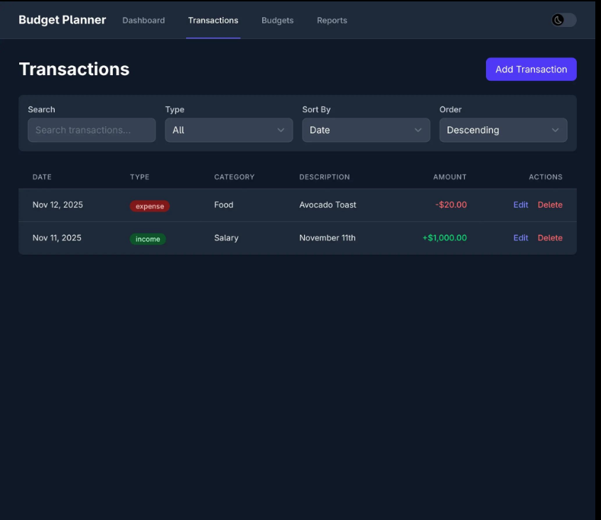
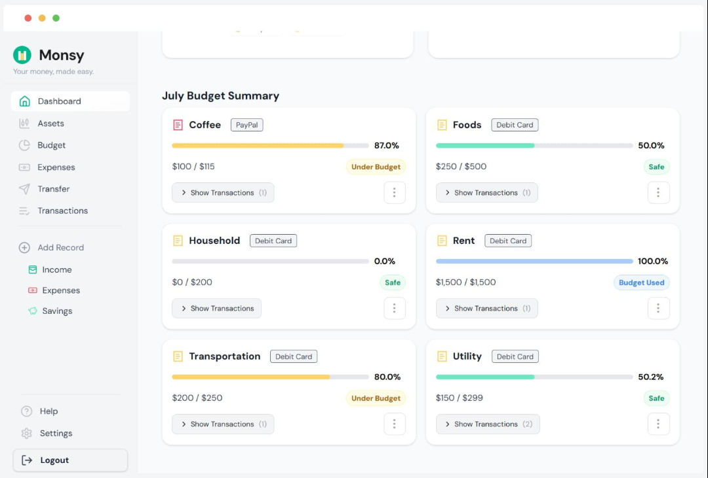

### Balance: 2,450

### Income: 4,000

### Expenses: -1,550

### Balance: Income - Expenses

### Transaction:

- A transaction means any movement of money.
  - Salary → +$3000
  - Groceries → -$100
  - Netflix → -$15
  - Freelancing → +$500
- Each transaction should have:
<pre>
{
    id,
    type,
    amount,
    category,
    description,
    date
}
{
    id: "abc123",
    type: "expense",
    amount: 45,
    category: "Food",
    description: "Dinner",
    date: "2026-09-16"
}
</pre>

- ### Adding Transaction:

- Clicking it opens a modal/form.
<pre>

* Add Transaction

Type:
○ Income
○ Expense

Amount:
[ 500 ]

Category:
[ Food ▼ ]

Description:
[ Dinner ]

Date:
[ 2026-09-16 ]

        Cancel   Add Transaction

</pre>
- Each transtion should have
    - Edit
    - Delete

- ### Editing Trasanction
      - The same form opens but with existing data
      - <pre>
          Type:
           Expense

            Amount:
            45

            Category:
            Food

            Description:
            Dinner

            Date:
            2026-09-16
- ### Deleting Transaction
    - If user click the Delete button show the modal
    <pre>
        Are you sure you want to delete this transaction?

        Cancel     Delete
    </pre>
</pre>

### Searching Transactions
- User should be able to search transactions by description and category
<pre>
filter()
includes()
toLowerCase()
</pre>

### Filtering
- Type:
[ All ▼ ] All Income Expense
- Category:
[ All Categories ▼ ]
- Date:
[ All Time ▼ ] 
Today
This Week
This Month
This Year
Custom

### Sorting
<pre>
Sort by:

Newest
Oldest
Highest amount
Lowest amount

- sort()
</pre>

### Monthly Summary
- Now your application starts becoming a real finance dashboard rather than just a CRUD exercise.
<pre>
September 2026

Income
$4,000

Expenses
$1,550

Balance
$2,450
</pre>

### Category Analytics
- Show where the money is going.
<pre>
Expenses by Category

Food          $450
Transport     $200
Shopping      $300
Bills         $400
Entertainment $200
</pre>
- You could also visuale this with charts 
<pre>
Food          ███████████████
Bills         ███████████
Shopping      ████████
Transport     █████
Entertainment █████
</pre>
<pre>
reduce()
objects
arrays
grouping data
calculations
DOM rendering
</pre>

### Budget System
- A budget is a spending limit.
<pre>
Food Budget

Limit: $500
Spent: $350

██████████████░░░░░░

$150 remaining


Food Budget

Limit: $500
Spent: $350

██████████████░░░░░░

$150 remaining

- if the user exceeds the limit:
🔴 Food budget exceeded by $50
</pre>

- Budget Overview:
<pre>
Budgets

Food
$350 / $500

Transport
$120 / $300

Entertainment
$180 / $200
</pre>

### Data Hanlding
- You should be able to display
<pre>
2026-09-16 -> Sep 16, 2026
</pre>
- And Group Transaction
<pre>
Today
Yesterday
Sep 14
Sep 13
</pre>
- You'll get practical experience with the JavaScript Date API.

### LocalStorage
- This is mandetory for this project
- Without that:
<pre>
Add transaction
↓
Refresh page
↓
Everything disappears 😭
</pre>
<pre>
localStorage.setItem()
localStorage.getItem()
JSON.stringify()
JSON.parse()
</pre>

### Import/Export Data
- This is where we can make the project considerably more advanced.
<pre>
- User clicks:
Export Data
- Downlaod Somthing Like:
moneytrack-data.json
- or CSV
- or you could import Data
Import Data
[ Choose File ]
</pre>
<pre>
File API
JSON
Blob
file inputs
parsing data
validation
</pre>

### Validation
- Your application shouldn't accpet grabage data
<pre>
Amount:
[ -50 ]
Amount:
[ abc ]
Description:
[              ]
- Show "Please enter a valid amount."
- You should validate 
    - amount
    - transaction type
    - category
    - description
    - date
</pre>

### Loading / UI States
- For a local app, loading isn't hugely important, but you can still have states such as:
<pre>
Loading...
Saving...
</pre>
- This becomes more useful if you later add an API.
#### Notifications / Toasts
- After actions:
    - ✓ Transaction added
    - ✓ Transaction updated
    - ✓ Transaction deleted
- or:
    - ⚠️ Budget exceeded
- These can disappear automatically after a few seconds.
- Great DOM/event practice.


### Responsive Design:
- it should work on:
<pre>
Desktop
Tablet
Mobile
</pre>


### Dark Mode:
<pre>
☀️ / 🌙

- This is a nice opportunity to practice:

CSS variables
classes
classList
localStorage
</pre>

### Currency
- Start with one currency so you don't make the project unnecessarily complicated.
- For example:
    - $
    - Later you can support:
    - USD
    - EUR
    - GBP
    - AFN
- and potentially use a currency API as an optional advanced feature.

### Settings
Create a small settings page/panel:
<pre>
Settings

Currency
[ USD ▼ ]

Theme
○ Light
○ Dark

Default transaction type
[ Expense ▼ ]

Data
[ Export Data ]
[ Import Data ]

[ Clear All Data ]
</pre>
- For Clear All Data, require confirmation.


# Design
- ## Overall App:
<pre>
┌──────────────────────────────────────────────────────────────────┐
│  MoneyTrack                                      🔔  🌙  👤      │
├───────────────┬──────────────────────────────────────────────────┤
│               │                                                  │
│  🏠 Dashboard │                                                  │
│               │                                                  │
│  💳 Transactions                                               │
│               │                  MAIN CONTENT                   │
│  🎯 Budgets   │                                                  │
│               │                                                  │
│  📊 Analytics │                                                  │
│               │                                                  │
│  ⚙️ Settings  │                                                  │
│               │                                                  │
│               │                                                  │
│  ──────────── │                                                  │
│  💾 Data      │                                                  │
│               │                                                  │
└───────────────┴──────────────────────────────────────────────────┘
</pre>

- Data area for import/export.
- ## Cards
<pre>
┌──────────────────┐ ┌──────────────────┐ ┌──────────────────┐ ┌──────────────────┐
│ TOTAL BALANCE    │ │ TOTAL INCOME     │ │ TOTAL EXPENSES   │ │ SAVINGS          │
│                  │ │                  │ │                  │ │                  │
│ $2,450           │ │ $4,000           │ │ $1,550           │ │ $2,450           │
│                  │ │                  │ │                  │ │                  │
│ ↑ 12.5%          │ │ ↑ 8.2%           │ │ ↓ 4.1%           │ │ 61.2% of income │
└──────────────────┘ └──────────────────┘ └──────────────────┘ └──────────────────┘

- Balance = Income - Expenses
- Savings = Income - Expenses
</pre>
- ## Monthly Chart
<pre>
┌───────────────────────────────────────────────────────────────┐
│ Monthly Overview                         September 2026 ▼     │
│                                                               │
│                                                               │
│             📈 Income / Expense Chart                         │
│                                                               │
│     $4000 ┤                         ╭──╮                       │
│           │              ╭──╮      │  │                       │
│     $3000 ┤        ╭──╮  │  │      │  │                       │
│           │   ╭──╮ │  │  │  │ ╭──╮│  │                       │
│     $2000 ┤   │  │ │  │  │  │ │  ││  │                       │
│           │───┴──┴─┴──┴──┴──┴─┴──┴┴──┴──                    │
│             1   5   10   15   20   25   30                  │
│                                                               │
└───────────────────────────────────────────────────────────────┘
</pre>
- ## Spending By Category
<pre>
┌───────────────────────────────────────────────────────────────┐
│ Monthly Overview                         September 2026 ▼     │
│                                                               │
│                                                               │
│             📈 Income / Expense Chart                         │
│                                                               │
│     $4000 ┤                         ╭──╮                       │
│           │              ╭──╮      │  │                       │
│     $3000 ┤        ╭──╮  │  │      │  │                       │
│           │   ╭──╮ │  │  │  │ ╭──╮│  │                       │
│     $2000 ┤   │  │ │  │  │  │ │  ││  │                       │
│           │───┴──┴─┴──┴──┴──┴─┴──┴┴──┴──                    │
│             1   5   10   15   20   25   30                  │
│                                                               │
└───────────────────────────────────────────────────────────────┘
- This section will later be generated from the transaction data.
</pre>
- ## Budgets
<pre>
┌─────────────────────────────────────────────────────┐
│ Budgets                              View all →      │
│                                                     │
│ Food                                                │
│ $350 / $500                                         │
│ ██████████████████░░░░░                            │
│ $150 remaining                                      │
│                                                     │
│ Transport                                           │
│ $120 / $300                                         │
│ ████████░░░░░░░░░░░                               │
│ $180 remaining                                      │
│                                                     │
│ Entertainment                                       │
│ $180 / $200                                         │
│ ██████████████████████░                            │
│ $20 remaining                                       │
└─────────────────────────────────────────────────────┘
</pre>
- ### Recent Transactions
<pre>
┌─────────────────────────────────────────────────────┐
│ Budgets                              View all →      │
│                                                     │
│ Food                                                │
│ $350 / $500                                         │
│ ██████████████████░░░░░                            │
│ $150 remaining                                      │
│                                                     │
│ Transport                                           │
│ $120 / $300                                         │
│ ████████░░░░░░░░░░░                               │
│ $180 remaining                                      │
│                                                     │
│ Entertainment                                       │
│ $180 / $200                                         │
│ ██████████████████████░                            │
│ $20 remaining                                       │
└─────────────────────────────────────────────────────┘
</pre>
- ## Transactions
- Header: 
<pre>
Transactions
Track and manage all your income and expenses.
                         + Add Transaction
</pre>

- ## Summary
<pre>
┌────────────────┐ ┌────────────────┐ ┌────────────────┐
│ Transactions   │ │ Income         │ │ Expenses       │
│                │ │                │ │                │
│ 128            │ │ $4,000         │ │ $1,550         │
└────────────────┘ └────────────────┘ └────────────────┘
</pre>
- ## Transaction Search & filter
<pre>
┌─────────────────────────────────────────────────────────────┐
│ 🔍 Search transactions...                                  │
└─────────────────────────────────────────────────────────────┘

Type:       [ All ▼ ]
Category:   [ All Categories ▼ ]
Date:       [ This Month ▼ ]
Sort:       [ Newest First ▼ ]
</pre>

- ## Trasnaction Table
<pre>
┌──────┬──────────────┬──────────────┬──────────┬──────────┬────────┐
│      │ Description  │ Category     │ Date     │ Amount   │        │
├──────┼──────────────┼──────────────┼──────────┼──────────┼────────┤
│ 🍔   │ Dinner       │ Food         │ Sep 16   │ -$45.00  │ ⋮      │
│ 💼   │ Salary       │ Salary       │ Sep 15   │ +$3000   │ ⋮      │
│ 🚕   │ Taxi         │ Transport    │ Sep 14   │ -$12.00  │ ⋮      │
│ 🎬   │ Netflix      │ Entertainment│ Sep 13   │ -$15.00  │ ⋮      │
└──────┴──────────────┴──────────────┴──────────┴──────────┴────────┘
- :
┌───────────────┐
│ ✏️ Edit       │
│ 🗑 Delete     │
└───────────────┘
</pre>
- ## Add Transaction Model
- This is one of the most important components.
- Click:
- + Add Transaction
<pre>
┌──────────────────────────────────────────┐
│ Add Transaction                      ✕   │
│                                          │
│ Transaction Type                         │
│                                          │
│  [ Expense ]       [ Income ]             │
│                                          │
│ Amount                                   │
│ ┌──────────────────────────────────────┐ │
│ │ $ 45.00                              │ │
│ └──────────────────────────────────────┘ │
│                                          │
│ Category                                 │
│ ┌──────────────────────────────────────┐ │
│ │ Food                              ▼  │ │
│ └──────────────────────────────────────┘ │
│                                          │
│ Description                              │
│ ┌──────────────────────────────────────┐ │
│ │ Dinner                               │ │
│ └──────────────────────────────────────┘ │
│                                          │
│ Date                                     │
│ ┌──────────────────────────────────────┐ │
│ │ 2026-09-16                           │ │
│ └──────────────────────────────────────┘ │
│                                          │
│             Cancel    Add Transaction    │
└──────────────────────────────────────────┘
</pre>

- ## Edit Transaction Model
<pre>
- Same component, but different title:
Edit Transaction

- Existing information is already filled:
Type:        Expense
Amount:      $45
Category:    Food
Description: Dinner
Date:        Sep 16

- Button:
Save Changes
- This is intentionally the same UI structure as Add Transaction.
</pre>

- ## Delete Confirmation
- Don't make another entire screen.
- Use a small confirmation modal:
<pre>
┌──────────────────────────────────────┐
│ Delete Transaction?              ✕   │
│                                      │
│ Are you sure you want to delete      │
│ this transaction?                    │
│                                      │
│ Dinner                               │
│ Food • $45.00                        │
│                                      │
│          Cancel       Delete         │
└──────────────────────────────────────┘
</pre>

- ## Budgets

<pre>
    ### Budget Summary
    ┌────────────────────┐ ┌────────────────────┐ ┌────────────────────┐
    │ Total Budget       │ │ Total Spent        │ │ Remaining          │
    │                    │ │                    │ │                    │
    │ $2,000             │ │ $1,250             │ │ $750               │
    └────────────────────┘ └────────────────────┘ └────────────────────┘

    ### Budget Card
    ┌────────────────────────────────────────────────────┐
    │ 🍔 Food                                    ⋮       │
    │                                                    │
    │ $350 spent                         $500 budget     │
    │                                                    │
    │ ██████████████████░░░░                            │
    │                                                    │
    │ $150 remaining                                     │
    └────────────────────────────────────────────────────┘

    ### Exceeded
    $350 spent                    $300 budget

    ██████████████████████████████████

    ⚠️ $50 over budget
</pre>
    
- ## Create Budget
<pre>
┌────────────────────────────────────────┐
│ Create Budget                      ✕   │
│                                        │
│ Category                               │
│ [ Food                              ▼ ] │
│                                        │
│ Monthly Limit                          │
│ [ $500                              ]   │
│                                        │
│ Month                                  │
│ [ September 2026                   ▼ ] │
│                                        │
│              Cancel   Create Budget    │
└────────────────────────────────────────┘
</pre>

- ### Analytics Screen
Header:
<pre>
Analytics
Understand where your money goes.
Period:
[ September 2026 ▼ ]
</pre>
- Income vs Expenses
<pre>
┌─────────────────────────────────────────────────────┐
│ Income vs Expenses                                  │
│                                                     │
│        📊 Chart                                     │
│                                                     │
│ Income       $4,000                                 │
│ Expenses     $1,550                                 │
└─────────────────────────────────────────────────────┘
</pre>
- Spending by Category
<pre>
┌─────────────────────────────┐
│ Spending by Category        │
│                             │
│          ◯                 │
│       ◯       ◯            │
│     ◯           ◯          │
│                             │
│ Food             $450       │
│ Bills            $400       │
│ Shopping         $300       │
│ Transport        $200       │
└─────────────────────────────┘
</pre>
- A donut/pie chart can eventually go here.
- Daily / Monthly Spending
<pre>
┌─────────────────────────────────────────────────────┐
│ Spending Over Time                                  │
│                                                     │
│ 📈 Chart                                             │
│                                                     │
└─────────────────────────────────────────────────────┘
</pre>
- Financial statistics
<pre>
┌──────────────────┐ ┌──────────────────┐
│ Average Expense  │ │ Largest Expense  │
│                  │ │                  │
│ $51.67           │ │ $450             │
└──────────────────┘ └──────────────────┘

┌──────────────────┐ ┌──────────────────┐
│ Most Used        │ │ Transactions     │
│ Category         │ │                  │
│ Food             │ │ 128              │
└──────────────────┘ └──────────────────┘
</pre>
- These are excellent reduce() exercises.

- ## Settings
<pre>
Settings

Appearance
────────────────────────────

Theme

○ Light
○ Dark
○ System


Preferences
────────────────────────────

Currency
[ USD ▼ ]

Default transaction type
[ Expense ▼ ]


Data
────────────────────────────

Export Data
Import Data

Clear All Data
</pre>

### Export/Import Data
- When clicking Export Data:
<pre>
Export Your Data

Choose format:

[ JSON ]
[ CSV ]

                 Export
</pre>
- For import:
<pre>
Import Your Data

Upload your MoneyTrack data.

┌──────────────────────────────┐
│                              │
│       📁 Choose File         │
│                              │
└──────────────────────────────┘

Supported: JSON / CSV

              Import
</pre>
- We'll add validation/error messages later.

- ## Clear Data
<pre>
┌────────────────────────────────────────┐
│ ⚠️ Delete All Data                     │
│                                        │
│ This will permanently delete all      │
│ transactions and budgets.             │
│                                        │
│ This action cannot be undone.         │
│                                        │
│          Cancel     Delete Everything │
└────────────────────────────────────────┘
</pre>

- ## Toast Notifications
- These aren't screens. They're reusable UI components.
- Bottom-right:
<pre>
┌──────────────────────────────┐
│ ✓ Transaction added          │
└──────────────────────────────┘
</pre>

- Examples:
<pre>
✓ Transaction added
✓ Transaction updated
✓ Transaction deleted
✓ Budget created
✓ Data exported
</pre>

<pre>
- Errors:
⚠ Please enter a valid amount.
⚠ Something went wrong.
</pre>

- ## Empty States:
- Every important section needs an empty state.
- No transactions
<pre>
              💳

       No transactions yet

Add your first transaction
to start tracking your money.

       + Add Transaction
</pre>
- No budgets
<pre>
              🎯

        No budgets yet

Create a budget to control
your spending.

         + Create Budget
</pre>
- No search results
<pre>
              🔍

      No transactions found

Try changing your search or filters.
</pre>


### Mobile UI
<pre>
┌───────────────────────────┐
│ MoneyTrack          🌙    │
├───────────────────────────┤
│                           │
│ Good morning 👋           │
│                           │
│ ┌───────────────────────┐ │
│ │ Balance               │ │
│ │ $2,450                │ │
│ └───────────────────────┘ │
│                           │
│ ┌──────────┐ ┌──────────┐ │
│ │ Income   │ │ Expenses │ │
│ │ $4,000   │ │ $1,550   │ │
│ └──────────┘ └──────────┘ │
│                           │
│ Recent Transactions       │
│                           │
│ 🍔 Dinner       -$45      │
│ 💼 Salary      +$3000     │
│ 🚕 Taxi         -$12      │
│                           │
├───────────────────────────┤
│ 🏠    💳    🎯    📊    ⚙️ │
└───────────────────────────┘
</pre>
- And the + Add Transaction button can be a floating action button:
<pre>
                    ┌────┐
                    │  + │
                    └────┘
</pre>


# Whole Structure
<pre>
                         MoneyTrack
                             │
            ┌────────────────┼────────────────┐
            │                │                │
        Dashboard      Transactions        Settings
            │                │
            │                ├── Add
            │                ├── Edit
            │                └── Delete
            │
            ├── Overview
            ├── Spending
            ├── Budgets ──────┐
            │                 ├── Create
            │                 └── Edit
            │
            └── Recent

        Analytics
            │
            ├── Income vs Expenses
            ├── Category Spending
            ├── Spending Over Time
            └── Statistics
</pre>

# How to Actually Build This Projet?
<pre>
index.html
     ↓
small application shell
     ↓
main.js
     ↓
load/render screens
     ↓
individual JS modules
</pre>
- Folder Strucutre:
<pre>
expense-tracker/
│
├── index.html
│
├── css/
│   ├── main.css
│   ├── variables.css
│   ├── layout.css
│   │
│   ├── components/
│   │   ├── sidebar.css
│   │   ├── header.css
│   │   ├── modal.css
│   │   ├── button.css
│   │   ├── card.css
│   │   └── toast.css
│   │
│   └── pages/
│       ├── dashboard.css
│       ├── transactions.css
│       ├── budgets.css
│       ├── analytics.css
│       └── settings.css
│
├── js/
│   │
│   ├── main.js
│   │
│   ├── state/
│   │   └── state.js
│   │
│   ├── data/
│   │   ├── storage.js
│   │   └── defaultData.js
│   │
│   ├── pages/
│   │   ├── dashboard.js
│   │   ├── transactions.js
│   │   ├── budgets.js
│   │   ├── analytics.js
│   │   └── settings.js
│   │
│   ├── components/
│   │   ├── transactionCard.js
│   │   ├── transactionModal.js
│   │   ├── budgetCard.js
│   │   ├── summaryCard.js
│   │   ├── toast.js
│   │   └── modal.js
│   │
│   └── utils/
│       ├── formatCurrency.js
│       ├── formatDate.js
│       ├── validation.js
│       └── generateId.js
│
└── assets/
    └── ...
</pre>
- Think of `index.html` as the building, not all the furniture.
    ```html
    <body>

    <div class="app">

        <aside class="sidebar">
            <!-- navigation -->
        </aside>

        <main class="main">

            <header class="header">
                <!-- header -->
            </header>

            <div id="app">
                <!-- pages get rendered here -->
            </div>

        </main>

    </div>

    <!-- global modals -->
    <div id="modal-root"></div>

    <!-- notifications -->
    <div id="toast-root"></div>

    <script type="module" src="./js/main.js"></script>

</body>
```

### Reusable Components in Vanilla JS
- Don't write
<pre>
// Card 1
// Card 2
// Card 3
// Card 4

- Do this:
export function createSummaryCard(title, value) {

    return `
        <div class="summary-card">
            <span>${title}</span>
            <strong>${value}</strong>
        </div>
    `;
}

import { createSummaryCard } from "../components/summaryCard.js";

export function renderDashboard() {

    return `
        <section>

            <div class="summary-cards">

                ${createSummaryCard("Balance", "$2,450")}

                ${createSummaryCard("Income", "$4,000")}

                ${createSummaryCard("Expenses", "$1,550")}

                ${createSummaryCard("This Month", "$2,450")}

            </div>

        </section>
    `;
}

</pre>
<pre>
const transactions = [
    {
        id: 1,
        description: "Dinner",
        category: "Food",
        amount: 45,
        type: "expense"
    },
    {
        id: 2,
        description: "Salary",
        category: "Salary",
        amount: 3000,
        type: "income"
    }
];
export function createTransactionRow(transaction) {

    return `
        <tr>
            <td>${transaction.description}</td>
            <td>${transaction.category}</td>
            <td>${transaction.amount}</td>
            <td>
                <button data-id="${transaction.id}">
                    Edit
                </button>

                <button data-id="${transaction.id}">
                    Delete
                </button>
            </td>
        </tr>
    `;
}
</pre>